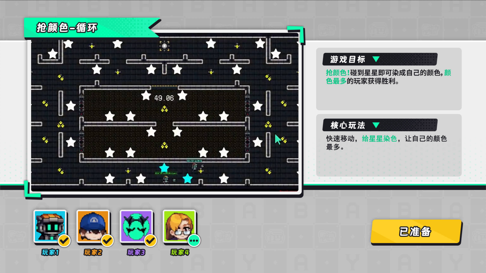
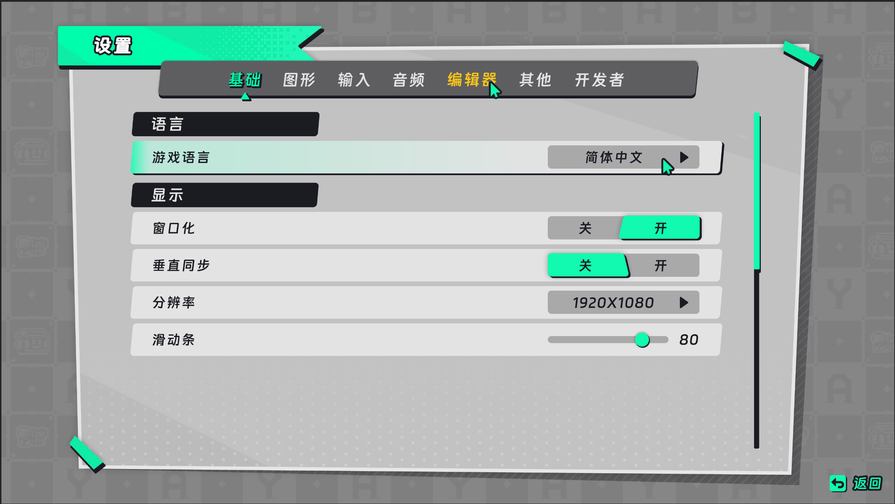
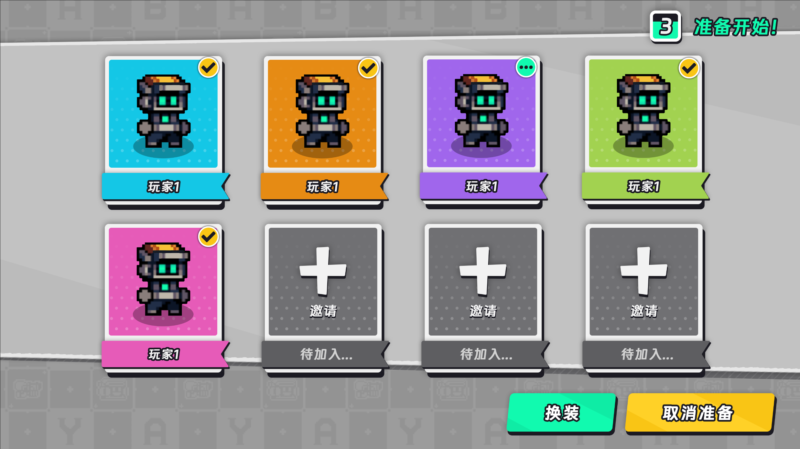

# 原始参考与视觉提炼

以下三图为用户提供的完整风格参考，保持原文件内容。它们用于观察组件样式；图中具体场景、游戏名称与文案不是模板的一部分。

## 页面框架

提取白色粗边、向右下偏移的黑色硬投影、薄荷绿护角、斜切标题飘带和黑色标题条。主内容面积优先，右侧卡片承载辅助信息。深色场景是内容示例，不作为所有界面的背景色。不要把完整截图作为产品背景。

## 设置与控件

提取浅灰容器、清晰分组、薄荷绿选中态、黄色重点标签和紧凑控件。主面板保持端正；外围可适量斜切。参考中局部存在柔和阴影，组件轮廓与主要层级仍以清楚边框和硬投影为主。

## 头像与行动按钮

提取彩色头像底板、白边黑影、名牌、状态角标与醒目按钮。像素风限定于角色和小图标，正文不套像素字体。大厅头像可大面积用身份色；信息密集列表缩减到头像底板或侧条，避免抢占主要操作区。

## 可复用参数

| 用途 | 建议值 |
|---|---|
| 页面背景 | #BFC0C2 |
| 浅色卡片 | #F4F4F0 |
| 描边、标题、硬投影 | #1C1D24 |
| 主强调 | #00DFA9 |
| 重点行动 | #FFD027 |
| 错误、紧急提示 | #F05261 |
| 次要文字 | #555861 |

这些是制作建议，不是原图的精确采样。以 1920×1080 为排版起点，可从安全边距 48、描边 3–4、硬投影偏移 5–8、标题 40–48、核心数字 56–72、正文 24–28、辅助说明 20–22 像素开始，再在实际设备上验证。不要把布局缩放系数重复乘到字体上。

装饰只进入外围和卡片边缘；正文、数据和操作内容保持干净。选中轮廓不得改变盒子尺寸或推动邻近元素。使用黑色文字搭配薄荷绿、黄色和浅色底；浅色文字只在足够深的背景上使用。
