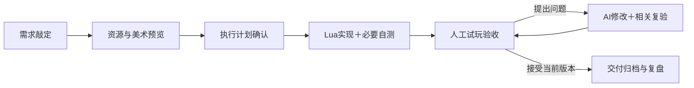

# Abya AI 开发工具与工作流程修改方案

- 日期：2026-10-10
- 状态：功能已实施并发布；完整新任务的耗时目标待试点验证
- 实施结果：[实施与验证记录](WORKFLOW_V2_IMPLEMENTATION_20261010.md)
- 依据任务：堵猫猫—流程测试02
- 任务 ID：`c89029c4-ce48-4145-b54d-82184514f523`
- 适用工程：`D:/Unity项目/ABYADesktopDevelopmentTool`
- 面向对象：通过开发工具 APP 发起制作、试玩和验收的策划

## 一、调整目标

这次升级围绕三个目标展开：

1. 资源与美术阶段提供可直接查看、反馈和敲定的视觉产物。
2. 策划通过 APP 即可打开正确版本的游戏，完成单人或多人验收。
3. 将“Lua 初版 → 8＋4 整体迭代 → 交付验收”改为“Lua 实现与必要自测 → 人工验收、修改与迭代 → 交付归档”。

三个问题需要一起设计，再分批实施。常规、同等规模且运行环境正常的任务，目标是将 AI 与工具的推进时间控制在 3–4 小时以内。

本文正文保留问题依据、修改范围、验收标准和实施顺序，作为原始方案基线。实际完成范围、验证结果和尚待新任务计时验证的事项，以实施记录为准。

## 二、本次测试的主要发现

已核对任务原生对话历史、APP 数据库、需求与计划、12 轮记录、94 条证据登记及相关实例启动日志。核对时，任务仍处于交付候选等待确认状态，作品版本为 `cat-v2-monotonic-r8`。

| 问题 | 核对结果 | 修改方向 |
|---|---|---|
| 美术成果难以验收 | 任务有临时猫图和后续游戏截图，但资源节点没有形成集中展示的视觉方案；页面主要展示模板、文件路径和文字 | 将预览图作为资源阶段的正式产物 |
| APP 启动后不能正常试玩 | 手动启动的 Host/Client 配置正确，但使用了旧 Player；AI 使用了时钟修复后的新 Player | 验收入口绑定任务版本和运行包 |
| 8＋4 耗时过长 | 迭代阶段跨度约 7 小时 53 分钟；R8 单轮约 4 小时 45 分钟；后四轮累计约 49 分钟，填写了 64 项问答，作品版本未再变化 | 取消固定轮数，保留必要验证，按实际问题返工 |

### 2.1 APP 启动问题的直接证据

2026-10-10 的实际记录如下，时间按北京时间表述：

| 启动方式 | 时间 | 实例 | 使用的 Player |
|---|---|---|---|
| APP 手动启动 | 15:11–15:12 | Host `c9f08939-033c-4e34-a022-4184e3276319`；Client `847bd275-3d6f-4631-8de1-31d60b527584` | `D:/AbyaCliValidation/Bot-Player-20260929/ABYA_PB.exe` |
| 请求 AI 打开验收窗口 | 15:16 | Host `f4f01cdf-06b8-4a56-a9af-b6f9b5b439a3`；Client `0894be45-f540-4ddc-867a-5a715de27adb` | `D:/AbyaBuild/CatTrapClockFix-20261009/ABYA_PB.exe` |

手动启动时，两端的 Host/Client 模式、存档、关卡与房间端口均匹配，启动报告显示网络已连接。但旧包中出现以下玩法脚本错误：

- `cat-match-clock` 第 55 行：`attempt to compare number with nil`。
- `cat-match-listener` 第 41 行：`attempt to perform arithmetic on a nil value`。

当前玩法通过 `abya.time.monotonic` 读取新包提供的服务端时钟。APP 的通用启动入口使用全局配置的旧运行包，AI 则明确指定修复后的运行包。

因此，本次故障有明确的版本错配证据：新玩法被旧运行包加载，APP 未提前识别不兼容，也未将玩法初始化错误呈现为验收阻塞。不能仅根据“进程启动成功”或“网络已连接”判断可试玩。

### 2.2 耗时应如何理解

- Lua 实现阶段的事件跨度约 3 小时 10 分钟。
- 8＋4 迭代阶段的事件跨度约 7 小时 53 分钟。
- 计划确认至交付候选提交，总跨度约 11 小时 11 分钟。
- R8 包含计时异常排查、暂停与授权等待、宿主补丁、构建和复验，不能把整段时间都视为可删除的重复检查。
- 后四轮累计约 49 分钟，作品版本未变化，但其中仍有边界、并列和冷启动等验证，不能把“未改代码”等同于“没有验证价值”。
- 记录中的 30 次完整循环脚本尝试，已知墙钟合计约 68 分钟，包含取证、CLI 等待和失败尝试；该时间与阶段时间重叠，不能相加。
- 纯模型推理时间、连接等待独占时间及部分历史中断分段无法准确取得，继续标为未知。

取消固定轮次可以减少重复工作，但要稳定达到 3–4 小时，还需要改善实现复用、环境预检和平台问题处理。

## 三、拟采用的新流程

保留三个正式确认点：需求文档、执行计划、最终作品。

美术方案随执行计划一起确认，不增加第四个强制批准节点。人工试玩可以反复进行，不设固定轮数；普通缺陷修正不要求重新确认全部需求与计划。

小桌坊当前已采用“制作 → 人工体验与返工 → 收尾”，取消固定自检轮次，并强调局部修改只复验受影响部分。Abya 借鉴这些原则，继续直接制作 Unity Lua，不引入 Web 制作与迁移环节。

参考：[小桌坊工作流指南](http://172.16.20.160:8765/public/workflow-guide.html)、[阶段操作与结束判断](http://172.16.20.160:8765/public/production/stage-execution.md)。

## 四、资源与美术节点改造

### 4.1 节点必须交付的内容

| 产物 | 用途 | 堵猫猫示例 |
|---|---|---|
| 素材预览板 | 确认角色、字体、颜色与控件风格 | 猫、格点、障碍、按钮、字体 |
| 游戏整体示意图 | 确认布局、比例与信息层级 | 棋盘、侧栏、计时、双方成绩 |
| 关键状态效果预览 | 确认表现和反馈是否清楚 | 落障、猫移动、围堵成功、结算 |

默认提交一套主要方案和必要状态图，不为挑风格生成大量无用方案。存在明确风格分歧时，再提供少量可比较的候选。

### 4.2 区分设计示意与实际效果

- 所有视觉产物明确标记为参考图、设计示意、引擎渲染或实际游戏截图。
- 资源阶段先提供组合示意；可独立预览的素材提供实际渲染，不要求提前实现完整游戏。
- Lua 实现后，将真实游戏截图回填到同一资源节点，与已确认方案对照。
- 动作和特效提供短视频或动图；静态资源不强制录像。
- 临时素材明确显示“临时”，记录后续是否需要替换。
- 记录资源来源、导入规格、方案版本和对应用途，避免只展示一张脱离游戏场景的素材图。

### 4.3 APP 展示与反馈

资源节点增加缩略图、放大查看、版本对照和针对图片提交反馈的入口。

视觉产物关联具体方案版本。执行计划确认同时绑定这些产物，避免确认后无记录地替换图片。反馈和后续修改保留对应关系，不覆盖历史方案。

复用现有任务产物登记与图片读取能力，并扩展为阶段产物预览；不能仅依赖终端活动中的截图入口。

### 4.4 验收标准

策划无需翻找文件夹或终端历史，即可在资源节点看清整体风格、布局和关键效果，指出具体修改位置，并在执行计划确认时敲定对应版本。

## 五、游戏验收启动改造

### 5.1 增加任务专属的“一键开始验收”

保留通用实例管理，另增面向策划的验收入口。

每个可试玩版本保存一份验收配置，绑定实际 Player 及版本指纹、存档与关卡、作品版本、人数模式、席位数量、窗口配置和必要运行能力。

该配置应从已核验的任务版本生成，不能仅引用一个可能过期的全局运行包路径。

### 5.2 启动流程

1. 核对运行包和存档是否仍匹配当前候选版本。
2. 多人任务先启动 Host，等待运行就绪，再启动关联 Client。
3. 所有实例使用相同的验收运行包和对应存档。
4. 检查网络连接、身份、必要 Lua 初始化及玩法入口。
5. 显示窗口并停止自动输入，将操作交给策划。

APP 状态区分“进程启动”“网络已连接”“玩法已就绪”。例如本次旧包应提示“当前运行包缺少玩法所需能力，不能开始验收”，而不是只显示连接成功。

### 5.3 APP 与 AI 共用同一套验收行为

现有 APP 和 CLI 已共用底层实例服务，主要缺口在上层版本选择、成对启动和就绪检查，无需重写联机模块。

新增统一的验收启动编排：APP 按钮和 AI 调用使用同一配置与检查规则。任务模块保存验收信息，实例模块负责进程启动与生命周期，保持已有模块职责。

还需处理：

- 重复点击时复用或明确提示已有验收会话，避免无意创建多组实例。
- APP 重启、旧实例退出后，可以按已保存配置恢复验收。
- Client 启动失败时显示具体阶段和原因，只处理本次启动产生的实例。
- 运行包缺失、指纹变化或能力不匹配时，不静默退回全局旧包。
- Host/Client 的运行包一致性也纳入检查，不能只继承存档与端口。

### 5.4 验收标准

关闭并重新打开 APP 后，不向 AI 发送打开游戏的请求，直接点击验收按钮即可进入正确的双人房间。使用真实鼠标完成准备、开局、三关、结算和重开。

不同物理机器的 LAN 测试单独记录，不用同机双窗口替代。本次已核对的成功链路为同机双进程验收。

## 六、将 8＋4 替换为人工反馈迭代

### 6.1 首次交给策划前保留必要自测

Lua 实现完成后，执行与需求对应的一组必要自测，通过后立即交给策划试玩：

- 核心循环、胜负与结算。
- 保存后冷启动、退出与重开。
- 实际输入和主要页面。
- 多人任务的身份、权限和同步。
- 本次实现中特别容易出错的边界。

不再每轮重复全部维度及 16 道问答。原题库保留为按需参考，不继续作为强制填表任务。

### 6.2 反馈闭环

统一记录以下状态：

**反馈提出 → AI 定位 → 修改完成 → 相关复验 → 等待策划复验 → 关闭问题。**

反馈自动关联当前作品版本、验收实例及可用日志。策划可以直接描述问题并附图或录像，AI 负责整理复现步骤，不要求策划填写复杂报告。

每次提交新候选，展示本次修改、复验结果、仍未解决的问题及需要策划重点复验的操作。

### 6.3 按影响范围决定复验范围

| 修改类型 | 处理方式 |
|---|---|
| 错字、字号、局部布局 | 检查相关页面与操作区域 |
| 计分、回合、同步 | 检查对应逻辑及受影响流程 |
| 基础时钟、存档结构等共享能力 | 扩大回归范围 |
| 新增玩法范围 | 更新受影响的需求与计划 |
| 未受影响的既有内容 | 引用有效证据，说明复用依据 |

AI 可标记“已修复待复验”，最终接受由策划决定。接受绑定具体作品版本，旧版本的认可不能自动覆盖行为发生变化的新版本。

### 6.4 修改后端交付条件

当前后端仍要求第 12 轮关闭和 R12 证据。新流程必须同步修改这些校验，不能只删除 Skill 中的“8＋4”文字。

新的交付条件应依据：必要实现已完成、所需验证有效、必要问题已处理、运行版本一致，以及用户接受当前候选。

自检通过、AI 修复完成、策划接受和归档完成分别记录，不能互相代替。

## 七、耗时目标与提速措施

### 7.1 试点预算

以下适用于同等规模、环境正常的常规任务，统计 AI 与工具的推进时间，不包含策划答题、确认和试玩的等待时间。

| 工作 | 目标预算 |
|---|---:|
| 资源整理与必要预览 | 15–25 分钟 |
| 方案与能力预检 | 10–15 分钟 |
| Lua 实现 | 75–105 分钟 |
| 必要自测 | 15–20 分钟 |
| 常见人工反馈修正 | 30–50 分钟 |
| 交付整理 | 5–10 分钟 |
| 合计 | 150–225 分钟 |

该预算是待验证目标，不是本次试点已取得的结果。持续增加需求或出现宿主缺陷时，应如实显示超时原因和剩余工作。

### 7.2 配套提速措施

- 尽早交出完整可玩版本，避免先精修局部表现。
- 复用已验证的房间、身份、计时、结算和重开模板。
- 环境预检按运行包和能力版本复用，相关依赖变化后再复核。
- 从结构化执行结果生成报告，减少反复手写同类说明。
- 围绕具体验证目的采集截图和录像，取消固定 R0/R8/R12 重复录制要求。
- 平台故障单独记录；受阻时继续可独立完成的部分，不扩大无关排查范围。
- 对修改后的部分及其依赖复验，保留未受影响的有效证据。

### 7.3 时间统计

APP 同时展示总历时、人工等待、有效推进、环境阻塞和反馈返工。

工具时间属于推进时间的一部分，不重复相加。重叠区间合并，缺失和未结束区间明确标识；过期的“执行中”状态需与实际会话状态核对。

下一批同规模任务记录首次可玩时间、各类耗时、反馈数量及返工收益，据此判断是否达到 3–4 小时目标，不能通过隐藏等待或删减验收来达标。

## 八、工程修改范围与旧任务兼容

| 范围 | 需要同步调整的内容 |
|---|---|
| 任务与生产记录 | 视觉产物、验收配置、反馈记录、版本关联、阶段与交付条件 |
| 实例管理 | 任务验收启动、运行包一致性、就绪检查、恢复与失败处理 |
| APP 界面 | 资源预览、验收入口、反馈闭环、版本展示和耗时统计 |
| Desktop CLI | 暴露与 APP 一致的验收及记录能力，更新接口说明 |
| Skill 与模板 | Codex/Grok 共用流程、阶段说明、迭代规则及产物模板 |
| 报告与发布 | 新报告结构、旧数据兼容、验证记录和发布说明 |

旧任务保留原对话、批准记录、12 轮报告及证据，不伪造新流程历史，也不自动重跑。

新任务默认使用新流程。已有任务通过明确的升级操作切换，保留仍然有效的需求与计划确认，对受影响的交付结论和证据进行重新验证。

当前“堵猫猫—流程测试02”固定使用流程 1.2.1；已发布 APP 的流程版本为 1.3.0。升级需考虑任务固定 Skill 与流程策略的机制，不能假设替换 APP 后已有任务会自动采用新规则。

## 九、分批实施与验收顺序

| 批次 | 主要改动 | 完成判断 |
|---|---|---|
| 第一批：修复验收启动 | 任务版本绑定、统一验收启动、能力与玩法就绪检查 | 堵猫猫从 APP 独立启动并正常试玩 |
| 第二批：补齐美术预览 | 资源产物登记、图片与视频展示、方案版本及反馈 | 资源节点可以看图敲定方案 |
| 第三批：替换 8＋4 | 新阶段、反馈记录、版本复验、交付校验、报告与计时 | 新任务在必要自测后进入人工迭代 |
| 第四批：完整试跑 | 同规模玩法跑完整流程并记账 | 验证首次可玩时间、总推进时间和实际返工收益 |

建议先做第一批。已确认的运行包错配会直接破坏人工验收循环；先保证策划能打开并玩到正确版本，再补齐视觉敲定和反馈迭代，后续各项才能实际验收。

每批修改按工程维护约定同步相关模块 Skill、变更说明和必要测试，完成前后端规定检查。最终还需真实 APP 与游戏验证，不能仅以代码检查通过替代验收。

## 十、资料与代码入口

### 任务资料

任务工作区：`D:/Unity项目/ABYA Desktop Development ToolWorkspaces/堵猫猫-流程测试02-c89029c4`。

- [任务制作记录](<D:/Unity项目/ABYA Desktop Development ToolWorkspaces/堵猫猫-流程测试02-c89029c4/artifacts/game-development/workflow.json>)
- [完整用时账本](<D:/Unity项目/ABYA Desktop Development ToolWorkspaces/堵猫猫-流程测试02-c89029c4/artifacts/game-development/pilot-final-timing.json>)
- [过程与返工记录](<D:/Unity项目/ABYA Desktop Development ToolWorkspaces/堵猫猫-流程测试02-c89029c4/artifacts/game-development/pilot-process-log.md>)
- [交付候选说明](<D:/Unity项目/ABYA Desktop Development ToolWorkspaces/堵猫猫-流程测试02-c89029c4/artifacts/game-development/delivery.md>)
- [2026-10-10 人工试玩交接](<D:/Unity项目/ABYA Desktop Development ToolWorkspaces/堵猫猫-流程测试02-c89029c4/artifacts/game-development/manual-test-handoff-20261010.json>)

### 本次诊断快照

- [启动报告与错误摘录](../src-tauri/target/workflow-audit-20261010/launch-logs.json)
- [任务配置与实例记录快照](../src-tauri/target/workflow-audit-20261010/result.json)

诊断快照位于构建临时目录，清理该目录可能使链接失效；关键事实、实例 ID 和错误信息已摘录到本文第二节。

### 主要代码与契约

- [通用实例启动界面](../src/features/instances/LaunchInstanceModal.tsx)
- [任务界面与全局运行包来源](../src/features/tasks/TasksView.tsx)
- [实例启动服务](../src-tauri/src/modules/instances/service.rs)
- [流程界面](../src/features/tasks/ProductionPanel.tsx)
- [交付条件校验](../src-tauri/src/modules/tasks/production/validation.rs)
- [制作阶段 Skill 参考](../.codex/skills/abya-game-development-task/references/production-stages.md)
- [现行 8＋4 规则](../.codex/skills/abya-game-development-task/references/whole-experience-review.md)
